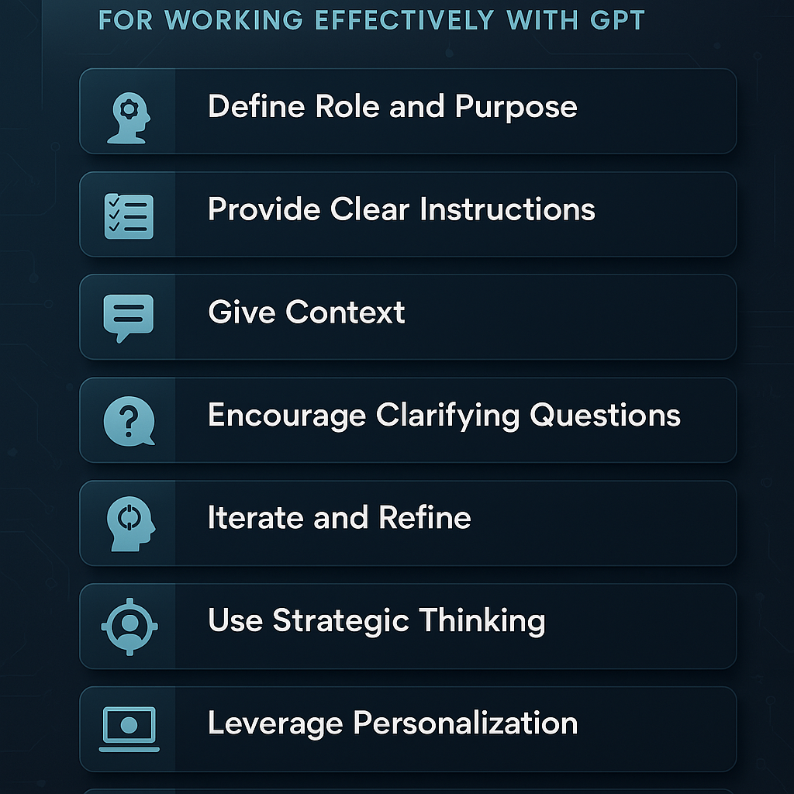

# 🚀 How to Work Effectively with AI: A Practical Framework for Getting the Best Out of GPT

**By Mohit Goyal – Infra Transformation Manager**

AI tools like GPT and Microsoft 365 Copilot are transforming how we work, think, and solve problems. But to truly unlock their potential, we need more than just access—we need a framework for collaboration. In this post, I’ll share a practical guide I use to work with AI effectively, inspired by Microsoft’s declarative agent design principles.

---

## 🧠 Why a Framework Matters

AI is not just a tool—it’s a thinking partner. Like any partner, it needs clarity, context, and collaboration. This framework helps you:
- Get personalized, relevant results.
- Save time by reducing back-and-forth.
- Encourage AI to ask questions and refine outputs.
- Align with Microsoft’s best practices for declarative agents.

---

## 🧩 The AI Collaboration Framework

### 1. **Define the Role and Purpose**
Clearly state what the AI should do and how it should behave:
- Role: Analyst, Consultant, Assistant, etc.
- Purpose: What outcome are you trying to achieve?

> _Example_: “Act as a digital transformation consultant helping me design a roadmap for AI adoption in infrastructure.”

---

### 2. **Provide Clear, Actionable Instructions**
Use specific verbs like:
- “Summarize,” “Analyze,” “Suggest,” “Compare,” “Visualize”

Break tasks into modular steps:
- **Goal**: What the step achieves
- **Action**: What AI should do
- **Transition**: When to move to the next step

> _Example_: “Summarize the key trends in AI infrastructure in bullet points with 2 examples per trend.”

---

### 3. **Give Context and Real-World Examples**
Help AI understand your environment:
- Background info
- Examples of good outputs
- Unique terms or business logic

> _Example_: “I’m preparing a presentation for senior leadership. I need a 3-slide summary of how AI can optimize cloud costs, similar to how AWS uses predictive scaling.”

---

### 4. **Encourage Clarifying Questions**
Let AI know it can:
- Ask questions if unclear
- Suggest better approaches
- Validate assumptions

> _Instruction_: “If anything is unclear, ask me before generating the output.”

---

### 5. **Iterate and Refine**
Treat the first output as a draft:
- Give feedback
- Ask for variations
- Request deeper dives

> _Example_: “This is good, but can you make it more concise and add a visual metaphor?”

---

### 6. **Use AI for Strategic Thinking**
Ask for:
- Frameworks
- Models
- Counterpoints

> _Example_: “What are the risks of over-automating infrastructure operations, and how can we mitigate them?”

---

### 7. **Leverage Personalization**
Share your:
- Preferences
- Goals
- Audience

> _Example_: “Make this explanation suitable for a non-technical executive audience.”

---

### 8. **Enable Multi-Modal Thinking**
Ask for:
- Diagrams
- Charts
- Code snippets

> _Example_: “Can you create a flowchart of the AI integration process in infrastructure management?”

---

### 9. **Incorporate Multi-Level Reasoning**
Encourage AI to reason through multiple layers of logic or abstraction:
- Ask it to consider short-term vs. long-term impacts
- Request trade-off analysis or scenario planning
- Use prompts that require synthesis across domains

> _Example_: “Evaluate the pros and cons of adopting AI-driven monitoring in infrastructure, considering both operational efficiency and long-term maintainability.”

**Benefits**:
- Produces more thoughtful, strategic outputs
- Helps uncover hidden assumptions
- Supports better decision-making

---

## ✅ Good Prompts vs. ❌ Bad Prompts

### 🔍 General Comparison

| **Prompt Type** | ❌ Bad Prompt | 🧨 Why It's Ineffective | ✅ Good Prompt | 🌟 Why It's Effective |
|----------------|--------------|-------------------------|----------------|------------------------|
| Vague Ask | “Tell me about AI.” | Too broad, lacks direction. | “Summarize the top 3 AI trends in infrastructure with examples from cloud providers.” | Clear scope and context. |
| No Context | “Write a strategy.” | No idea what domain or goal. | “Create a 6-month AI adoption strategy for infrastructure modernization in a mid-sized enterprise.” | Provides domain, timeline, and goal. |
| No Role Definition | “Help me with this.” | AI doesn’t know how to assist. | “Act as a transformation consultant and help me assess AI readiness in my org.” | Defines AI’s role and task. |
| No Format Guidance | “Explain this.” | Output may not match expectations. | “Explain this in bullet points suitable for a leadership deck.” | Guides output format and audience. |
| No Iteration Encouraged | “Give me the final version.” | Limits collaboration. | “Give me a draft version I can refine. Ask questions if anything is unclear.” | Encourages feedback loop. |

---

### 🧠 Use Case Examples

#### 📊 Strategy Development
- ❌ “How do I use AI in my work?”
- ✅ “I’m an Infra Transformation Manager. Suggest 3 AI use cases in infrastructure ops that align with cost optimization and automation goals.”

#### 📈 Data Analysis
- ❌ “Analyze this data.”
- ✅ “Analyze this cloud spend dataset to identify cost spikes and suggest optimization strategies. Present findings in a chart and summary.”

#### 🧪 Experimentation
- ❌ “Try something new.”
- ✅ “Generate 3 innovative ideas for using AI in predictive maintenance for data centers. Include pros and cons for each.”

#### 🗣️ Communication
- ❌ “Make this better.”
- ✅ “Rewrite this email to sound more persuasive and professional for a VP-level audience.”

---

## ✨ Final Thoughts

AI is only as good as the instructions it receives. By treating it as a collaborator—giving it context, clarity, and permission to ask questions—you can unlock its full potential. Whether you're a tech leader, strategist, or curious learner, this framework can help you work smarter with AI.

Inspired by Microsoft’s declarative agent design, this approach ensures your AI interactions are structured, scalable, and impactful.

---

